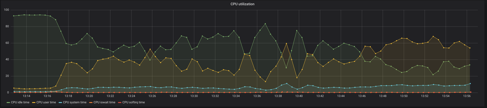
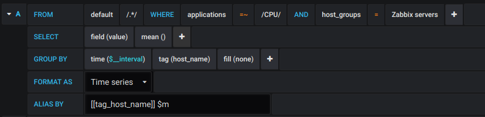

# Zabbix module to store history in InfluxDB

[Zabbix](https://www.zabbix.com/documentation) module mirroring all history data to [InfluxDB](https://docs.influxdata.com/influxdb) in real-time. It provides enhanced performance and easier usage with Grafana.


## Features

- Formats and writes Zabbix items' measurements to local or remote InfluxDB
- Full support for float, integer and string items (untested for text and log)
- Dedicated module config to set InfluxDB parameters (defaults listed, see `dist/history_influxdb.conf` for more details)
  - `InfluxDBAddress=localhost`
  - `InfluxDBName=zabbix`
  - `InfluxDBPortNumber=8086`
  - `InfluxDBProtocol=http`
  - `InfluxDBSSLInsecure=0`
  - `InfluxDBUser=`
  - `InfluxDBPassword=`


This is what you get in Grafana:



And how the data is queried:




# Installation

First find a place to put the Zabbix module. If your version of Zabbix is installed from packages, a good option may be `/usr/lib/zabbix/modules`. Create the directory if doesn't exist.

```
mkdir /usr/lib/zabbix/modules
cd /usr/lib/zabbix/modules
```

Download:
- `history_influxdb.so`
- `history_influxdb.conf`
From `dist/` of this repository (should you need a different build than x86_64, see [development - compiling](./DEVELOPMENT.md)).

Edit downloaded `history_influxdb.conf` to meet your needs (InfluxDB address, name, protocol, etc.), _the only mandatory value to put in is InfluxDBName_.

Now edit the main Zabbix server configuration file, usually in `/etc/zabbix/zabbix_server.conf` and change the modules section near the end to point to your module:

```
LoadModulePath=/usr/lib/zabbix/modules
...
LoadModule=history_influxdb.so
```

Restart Zabbix server daemon, usually:

```
systemctl restart zabbix-server
```

Open Zabbix log to spot any errors, usually `/var/log/zabbix_server.log`.

Now you should be able to see all the Zabbix data in InfluxDB and Grafana (if you have your datasource set).


# Security and Sustainability

Please consider using authorization with InfluxDB as described on
https://docs.influxdata.com/influxdb/v1.6/administration/authentication_and_authorization/#authorization.

The above has no real point if you don't use HTTPS. In order to do so, follow the instructions to set up a certificate and key on https://docs.influxdata.com/influxdb/v1.6/administration/https_setup/.

Please consider some [Downsampling and data retention](https://docs.influxdata.com/influxdb/v1.6/guides/downsampling_and_retention/) strategies in Influx.

Don't forget to maintain your Zabbix history by either build-in House keeping process or with table partitioning.


# Data format

- __metric name__ with expanded `$` placeholders, e.g. `Zabbix configuration cache, % free`
- __tags__
  - __host_name__ e.g. `Zabbix server`
  - __host_groups__ pipe separated list, e.g. `Zabbix servers|Linux servers`
  - __applications__ pipe separated list or not present, e.g. `Memory|OS`
- __value__ actual value float, integer or string, e.g. `96.181583`
- __timestamp__ nanosecond precision unix timestamp, e.g. `1536077503940736386`

```
<metric_str>,host_name=<str>,host_groups=<str>[,applications=<str>] value=<float|int|str> <timestamp>
```

Example of the payload sent to InfluxDB including escaping. Internally cURL is used to POST values to a URL similar to `http://localhost:8086/write?db=name_of_your_db` (constructed from history_influxdb.conf values). More information on writing to Influx using cURL can be found at https://docs.influxdata.com/influxdb/v1.6/guides/writing_data/


```
Zabbix\ configuration\ cache\,\ %\ free,host_name=Zabbix\ server,host_groups=Zabbix\ servers,applications=Zabbix\ server value=96.181583 1536077504941543030
Total\ memory,host_name=Zabbix\ server,host_groups=Zabbix\ servers,applications=Memory value=2090303488 1536077503940736386
```


# Background

We like to use [Grafana](http://docs.grafana.org/) to browse data from various monitoring sources and to create custom dashboards. The easiest way to integrate Zabbix with Grafana is to use a Grafana plug-in that directly hits Zabbix. However, this may jeopardize Zabbix if there are too many complicated requests from Grafana (and it's users).

Imagine some users (let's say 20 guys) are looking into data using Grafana and displaying history of last 90 days or having the last 1 hour refreshed every 10s to have a live view. This will generate exhaustive load on database backend, effectively blocking new values from being written on time.

Motivation for this module was to offer data collected by Zabbix for analysis and extensive querying to the wider audience. Our solution to this is to split Zabbix database backend and Grafana data source into two independent data stores, we have chosen InfluxDB for it's simplicity and focus on time series data, but other options here may be Elastic, Graphite or Prometheus.

Since Zabbix 3.2.0 we may use a module to [handle history data](https://www.zabbix.com/documentation/3.4/manual/config/items/loadablemodules), this project leverage this to forward data to InfluxDB.

Inspiration for this module originates from and credit goes to:
- https://grafana.com/plugins/alexanderzobnin-zabbix-app
- https://github.com/zensqlmonitor/influxdb-zabbix


## Compatibility and limitations

- Developed, built and tested on x86_64 Ubuntu 18.04 with Zabbix 3.4.14, InfluxDB 1.6.2, PostgreSQL 10.5.

- For non Intel builds you need to compile yourself (see [development](./DEVELOPMENT.md)).

- Only works with PostgreSQL database backend of Zabbix. MySQL will not work due to incompatibility of SQL queries (should be easy to develop though).

- Module will wrongly replace `$1`..`$9` in Zabbix item names if an item key has arguments contains arrays or commas in a quoted string. This is due to naive SQL based implementation.

- On contrary to direct Zabbix Grafana plug-in, this does not come with anything Grafana related, so you need to [set the InfluxDB datasource](http://docs.grafana.org/features/datasources/influxdb/) and create dashboards yourself.

- Currently the module _only syncs history of Float, Integer and String metrics_, not tested for type Text or Log.

- Macros are not considered (may occur in item keys)


# Development

Please see separate document on [development](./DEVELOPMENT.md)
